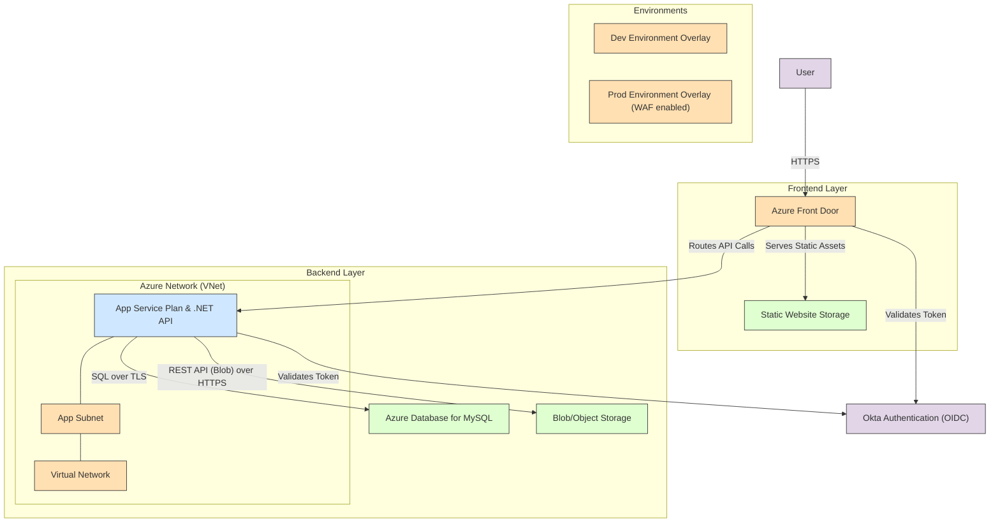

# Azure Two-Tier Web Application Infrastructure

This repository contains Azure ARM templates (Bicep) for deploying a two-tier web application infrastructure in Azure.

## Overview

- **Frontend**: React Static UI hosted in Azure Storage Account and served through Azure Front Door
- **Backend**: .NET API service hosted in Azure App Service with:
  - MySQL Server for data storage
  - Azure Storage Account for object storage
  - Okta authentication integration

## Environments

- **Development**: Lower-tier resources optimized for development and testing
- **Production**: Higher-tier resources with redundancy and security features

## IaC Architecture



## Application Architecture


## Deployment

### Prerequisites

- Azure CLI installed
- Azure subscription
- Resource Group created
- GitHub repository with the code

### Deployment Steps

1. Clone this repository
2. Set up the required secrets in GitHub:
   - AZURE_CREDENTIALS
   - AZURE_SUBSCRIPTION
   - AZURE_RG
3. Push to the appropriate branch:
   - `develop` branch for development environment
   - `main` branch for production environment

### Manual Deployment

```bash
# Login to Azure
az login

# Deploy to development
az deployment group create \
  --resource-group <your-resource-group> \
  --template-file ./environments/dev/main.bicep \
  --parameters ./environments/dev/parameters.json

# Deploy to production
az deployment group create \
  --resource-group <your-resource-group> \
  --template-file ./environments/prod/main.bicep \
  --parameters ./environments/prod/parameters.json
```

## Resources Created

- **Frontend**:
  - Storage Account for static website hosting
  - Front Door for global distribution and HTTPS
  
- **Backend**:
  - App Service Plan
  - App Service for .NET API
  - MySQL Server
  - Storage Account for object storage
  
- **Security**:
  - Okta integration for authentication
  - Web Application Firewall (Production only)

## Configuration

Update the parameters files in the `environments/dev` and `environments/prod` directories to customize the deployment for your needs.